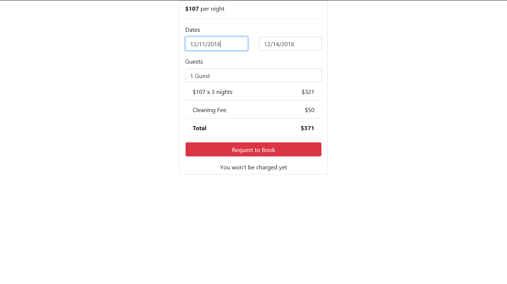
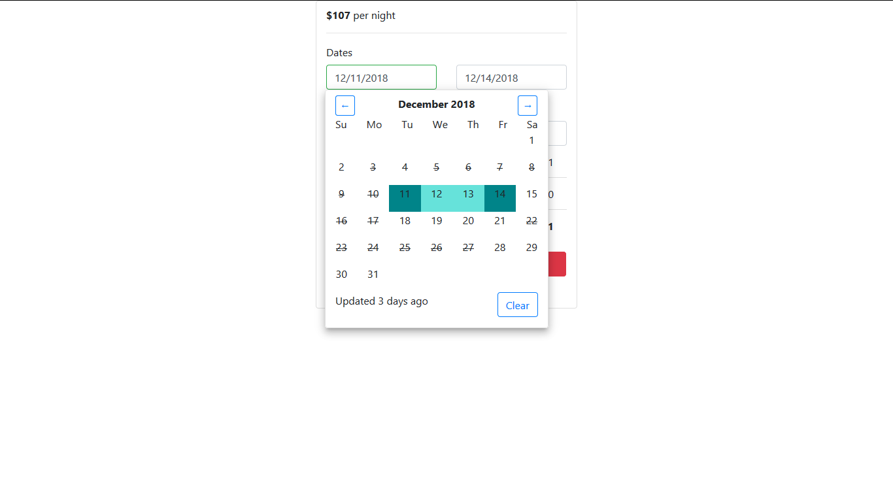

# CheckoutCalendarService
This is the implementation for the Checkout and Calendar service for Wander-Lodge.

## Setup Instructions

To run a test environment of this service, first install packages with `npm install`, then open two terminal windows to run `npm start` and `node server/server.js` to build a bundle and to launch the server backend. Ensure the MySQL daemon is running with `mysqld --console`. Now you may go to localhost:3004 to check out the service, and the endpoints are available as well.

Run `npx jest` to run all available test suites.

## Endpoint details
 * /api/listings/:id/reserved/ - Returns all reserved data ranges for which the selected rental is reserved, based on the variable ID path.
   * Query format: month, year
 * /api/:id/compute/ - Calculate price breakdown for the selected rental, based on the variable ID path.
   * Query format: number of nights, guests

## Libraries and Frameworks
 * Webpack 4
   * babel-loader, css-loader, postcss-loader, sass-loader
 * Babel
 * express.js
 * React 16
 * Bootstrap 4 as a CSS module
 * MySQL database and npm driver
 * material-ui for Popover UI component
 * Testing frameworks:
   * Jest
   * Enzyme

## Important Notes:
 * Bootstrap is loaded as a SCSS module. This requires the node-sass module, which requires installing VS Build Tools on Windows. I would prefer to just import compiled CSS but I could not get around an unexpected token error encountered during the build in `bootstrap.min.css`.

## Renders (Hover to see image title)

